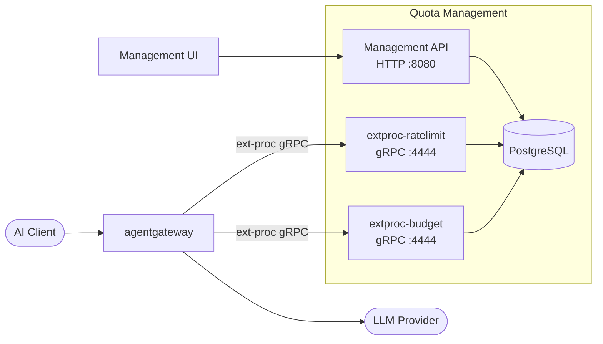
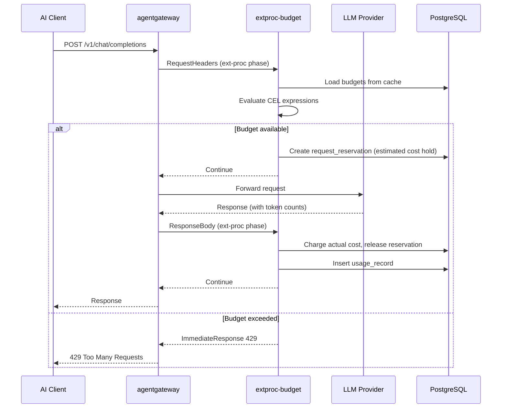

# quota-management

[](https://github.com/day0ops/quota-management/actions/workflows/release.yml)
[](LICENSE)
[](https://console.cloud.google.com/artifacts/docker/field-engineering-apac/australia-southeast1/kasunt)

A self-contained LLM cost governance and rate-limiting service that integrates with [agentgateway](https://agentgateway.dev) via the External Processing (ext-proc) API.

It enforces spending budgets and token/request rate limits on AI traffic in real time, with a management API and React UI for configuration.

---

## Features

### Budget Enforcement

- **Hierarchical budgets** with parent-child relationships and configurable fallback behavior
- **CEL expression matching** to target budgets by org, team, model, JWT claims, or any request attribute
- **Dual-phase enforcement**: pre-flight reservation before upstream call, actual charge after response
- **Period resets**: automatic hourly, daily, weekly, monthly, or custom reset cycles
- **Soft disable**: org admins can disable budgets without deleting history
- **Approval workflow**: budgets require org-admin approval before becoming active

### Rate Limit Orchestration

- **Per-team, per-model allocations** with token and request limits
- **Model pattern matching** (e.g., `gpt-4*`, `claude-*`) for wildcard allocations
- **Burst allowance** configurable per allocation
- **Dynamic metadata injection** into the rate limiter via ext-proc headers
- **Approval workflow** matching the budget workflow

### Cost Tracking

- **Real-time cost calculation** using per-model input/output token pricing
- **35+ pre-loaded model costs** covering OpenAI, Anthropic, Google, Mistral, AWS
- **Usage history** per budget with token counts and USD charges
- **Prometheus metrics** for cost trends, utilization, denials, and latency

### Management UI

- **Budget dashboard**: create, edit, view usage, reset periods
- **Model cost catalog**: manage token pricing per model
- **Rate limit allocations**: configure per-team limits
- **Approval queue**: org admins approve or reject pending budgets and allocations
- **Audit log**: full compliance trail of all actions

### Access Control

- **JWT-based identity**: org ID, team ID, user ID extracted from token claims
- **Role-based filtering**: org admins see all org budgets; team members see only their own
- **Audit trail**: all create/update/approve/reject actions are logged with actor identity

---

## Architecture Overview



**Three deployable components:**

| Component           | Purpose                                        | Ports                                 |
| ------------------- | ---------------------------------------------- | ------------------------------------- |
| `quota-management`  | Management API + React UI + Budget enforcement | gRPC :4444, HTTP :8080, Metrics :9090 |
| `extproc-budget`    | Budget enforcement only (standalone)           | gRPC :4444, Metrics :9090             |
| `extproc-ratelimit` | Rate limit metadata injection                  | gRPC :4444, Metrics :9090             |

The ext-proc servers implement the External Processor gRPC API. agentgateway calls them on every request and response to enforce budgets and inject rate limit metadata.

---

## How Budget Enforcement Works



For hierarchical budgets, the child budget is checked first. If the child is exhausted and `allow_fallback=true`, the request falls through to the parent budget.

---

## Quick Start

### Prerequisites

- Kubernetes cluster (or Docker Compose for local dev)
- agentgateway configured with ext-proc filter

### Deploy to Kubernetes

```bash
# Deploy PostgreSQL
kubectl apply -f deploy/postgres.yaml

# Deploy management API + UI
kubectl apply -f deploy/deployment.yaml

# Deploy budget enforcement ext-proc
kubectl apply -f deploy/extproc-deployment.yaml

# Deploy rate limit ext-proc (optional)
kubectl apply -f deploy/extproc-ratelimit-deployment.yaml

# Access UI
kubectl port-forward svc/quota-management 8080:8080
open http://localhost:8080
```

### Local Development

```bash
# Start PostgreSQL via Docker Compose
make dev-up

# Run Go server (hot reload)
make run

# Run UI dev server (hot reload, http://localhost:5173)
make ui-dev

# Run tests
make test

# Lint
make lint
```

### Docker Images

```bash
# Build all images
make docker-build-all

# Individual images
make docker-build              # Full app (API + UI)
make docker-build-extproc-budget
make docker-build-extproc-ratelimit
```

---

## Configuration

The service is configured via environment variables:

| Variable                        | Default          | Description                                     |
| ------------------------------- | ---------------- | ----------------------------------------------- |
| `DATABASE_URL`                  | required         | PostgreSQL connection string                    |
| `GRPC_PORT`                     | `4444`           | ext-proc gRPC server port                       |
| `HTTP_PORT`                     | `8080`           | Management API + UI port                        |
| `METRICS_PORT`                  | `9090`           | Prometheus metrics port                         |
| `LOG_LEVEL`                     | `info`           | Logging level (debug/info/warn/error)           |
| `BUDGET_CACHE_TTL`              | `30s`            | Budget definition cache duration                |
| `MODEL_COST_CACHE_TTL`          | `60s`            | Model pricing cache duration                    |
| `RESERVATION_TTL`               | `5m`             | Pre-request budget hold duration                |
| `DEFAULT_ESTIMATION_MULTIPLIER` | `1.5`            | Multiplier applied to pre-request cost estimate |
| `ORG_ID_HEADER`                 | `x-gw-org-id`    | Header carrying the organization ID             |
| `TEAM_ID_HEADER`                | `x-gw-team-id`   | Header carrying the team ID                     |
| `USER_ID_HEADER`                | `x-user-id`      | Header carrying the user ID                     |
| `MODEL_HEADER`                  | `x-gw-llm-model` | Header carrying the LLM model name              |

---

## CEL Expression Examples

Budgets match requests using [Common Expression Language (CEL)](https://cel.dev) expressions:

```cel
# Match any request
true

# Match by LLM model
llm.model == "gpt-4o"

# Match models from a provider
llm.model.startsWith("claude-")

# Match by org from JWT
jwt.claims.org_id == "acme-corp"

# Match a specific team on a specific model
jwt.claims.team_id == "platform-eng" && llm.model == "gpt-4o-mini"

# Match by request header
request.headers["x-environment"] == "production"

# Match by org ID header (for UI budget definition)
# Headers are set by gateway JWT transformation before reaching ext-proc
"x-gw-org-id" in request.headers && request.headers["x-gw-org-id"] == "acme-corp"
```

---

## Tech Stack

**Backend (Go)**

- [pgx](https://github.com/jackc/pgx) - PostgreSQL driver
- [zerolog](https://github.com/rs/zerolog) - Structured logging
- [cel-go](https://github.com/google/cel-go) - CEL expression evaluation
- [google/cel-spec](https://github.com/google/cel-spec) - ext-proc gRPC stubs
- [Prometheus client](https://github.com/prometheus/client_golang) - Metrics

**Frontend (TypeScript)**

- React 19
- React Router v7
- SWR - data fetching with cache
- Emotion - CSS-in-JS styling
- Vite + Bun

**Infrastructure**

- PostgreSQL 16 - state store
- External Processor API (gRPC) - gateway integration
- Prometheus - metrics collection
- Kubernetes - deployment target

---

## Documentation

- [Architecture](docs/ARCH.md) - Component design, data flow, deployment topology
- [Design](docs/DESIGN.md) - API reference, data models, business logic, workflows
