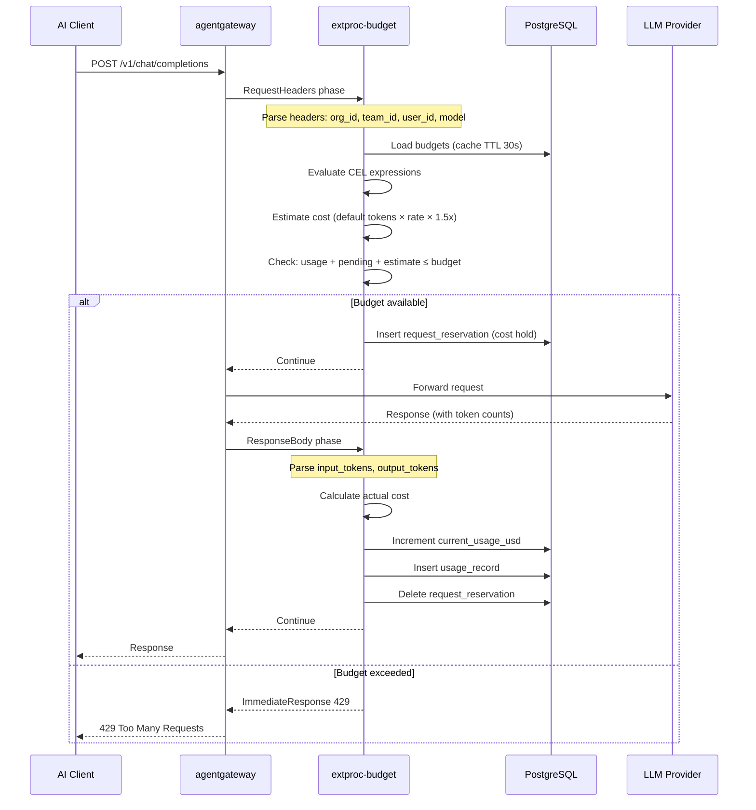
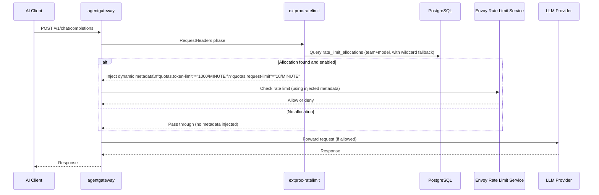
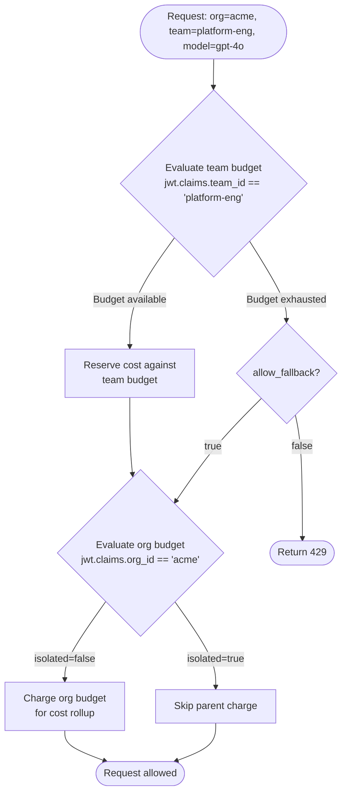

# Architecture

This document describes the runtime architecture of the Quota Management system: how components are structured, how traffic flows, and how the system integrates with agentgateway.

---

## Component Overview

The system is composed of three independently deployable services, all backed by a shared PostgreSQL database:

```mermaid
graph TD
    subgraph cluster [Kubernetes Cluster]
        subgraph agw [agentgateway - kgateway + Envoy]
            ef[ext-proc filter\nbudget]
            rl[Envoy rate limit filter\ntoken/request enforcement]
        end

        eb[extproc-budget\nBudget checks\nMetrics :9090]
        er[extproc-ratelimit\nMetadata injection\nMetrics :9090]

        qm[quota-management\nManagement API + React UI\nHTTP :8080 | Metrics :9090]

        db[(PostgreSQL\n:5432)]
    end

    ef -->|gRPC :4444| eb
    rl -->|gRPC :4444| er
    eb --> db
    er --> db
    qm --> db
```

### Services

**`extproc-budget`**
The critical-path service. Sits inline with every AI request via Envoy ext-proc. Enforces spend limits by checking budgets before forwarding and recording actual costs after receiving the LLM response. This service must be low-latency and highly available.

**`extproc-ratelimit`**
Also inline with every request. Reads rate limit allocations from PostgreSQL (cached) and injects Envoy-compatible dynamic metadata into each request. Envoy's rate limit filter reads this metadata and enforces token/request quotas. This service does not block requests directly—it delegates enforcement to Envoy.

**`quota-management`**
The management plane. Provides a REST API for configuring budgets, model costs, rate limit allocations, and approval workflows. Serves the React UI. Also handles background tasks: period resets, reservation cleanup, model cost cache refresh.

---

## Request Lifecycle

### Budget Enforcement Flow



### Rate Limit Metadata Injection Flow



---

## Data Layer

### PostgreSQL Schema (summary)

```
model_costs                   ← Per-model token pricing (35+ pre-seeded)
budget_definitions            ← Budget configs with CEL expressions
  └── parent_id → self        ← Hierarchical budget tree
usage_records                 ← Actual charges per request per budget
request_reservations          ← Pre-flight cost holds (TTL: 5 min)
budget_approvals              ← Approval workflow history
rate_limit_allocations        ← Per-team, per-model rate limit settings
audit_log                     ← Compliance trail of all management actions
```

Full schema detail in [DESIGN.md](DESIGN.md#database-schema).

### Caching

Two in-memory caches in `extproc-budget` reduce database load on the hot path:

| Cache            | TTL        | Content                                |
| ---------------- | ---------- | -------------------------------------- |
| Model cost cache | 60 seconds | `model_id → {input_cost, output_cost}` |
| Budget cache     | 30 seconds | All enabled `budget_definitions`       |

Caches are refreshed by background goroutines. A cache miss falls back to a live PostgreSQL query. On model cost lookup failure, the system fails open (allows request, skips cost recording).

`extproc-ratelimit` caches rate limit allocations with a similar TTL to avoid per-request DB queries.

---

## Background Workers

The management service runs several background goroutines:

| Worker              | Interval | Function                                                             |
| ------------------- | -------- | -------------------------------------------------------------------- |
| Period reset        | 1 min    | Reset `current_usage_usd` when `current_period_start + period < now` |
| Reservation cleanup | 1 min    | Delete `request_reservations` where `expires_at < now`               |
| Model cost refresh  | 60 s     | Repopulate model cost cache from DB                                  |
| Audit retention     | Daily    | Delete audit log rows older than `AUDIT_RETENTION_DAYS` (90)         |
| Metrics refresh     | 5 min    | Recalculate Prometheus gauge values (usage, remaining, utilization)  |

---

## Hierarchical Budget Matching

Budget matching evaluates budgets in order from most specific (team-level) to most general (org-level or provider-level):



**Isolation flag**: if `isolated=true` on a child budget, the parent is not charged even when the child matches. This creates a separate spend envelope that doesn't roll up to the parent.

**Fallback flag**: if `allow_fallback=true`, an exhausted child budget allows the request to continue under the parent budget. If `allow_fallback=false`, exhausting the child blocks the request immediately.

---

## Kubernetes Deployment

### Services

```yaml
quota-management:
  ports:
    - 4444/TCP # gRPC ext-proc (full app mode)
    - 8080/TCP # Management REST API + React UI
    - 9090/TCP # Prometheus metrics

quota-management-extproc: # budget extproc only
  ports:
    - 4444/TCP # gRPC ext-proc
    - 9090/TCP # Prometheus metrics

quota-management-postgres:
  ports:
    - 5432/TCP # PostgreSQL
```

### Resource Profile

Each component is designed for low resource consumption in demo environments:

| Component         | Memory Request | Memory Limit | CPU Request | CPU Limit |
| ----------------- | -------------- | ------------ | ----------- | --------- |
| quota-management  | 64Mi           | 256Mi        | 50m         | 500m      |
| extproc-budget    | 64Mi           | 256Mi        | 50m         | 500m      |
| extproc-ratelimit | 32Mi           | 128Mi        | 25m         | 250m      |
| postgres          | 128Mi          | 512Mi        | 100m        | 500m      |

### Health Checks

The management API exposes:

- `GET /health` — liveness probe (returns 200 if service is running)
- `GET /ready` — readiness probe (returns 200 when DB connection is established)

The ext-proc servers expose the same endpoints on the metrics port.

---

## Observability

### Prometheus Metrics

**Budget enforcement (extproc-budget)**

| Metric                                          | Type      | Labels                                 |
| ----------------------------------------------- | --------- | -------------------------------------- |
| `budget_management_requests_total`              | Counter   | `result` (allowed/denied)              |
| `budget_management_checks_total`                | Counter   | `entity_type`, `name`, `result`        |
| `budget_management_check_duration_seconds`      | Histogram | `entity_type`                          |
| `budget_management_cost_charged_usd_total`      | Counter   | `entity`, `name`, `model`              |
| `budget_management_tokens_total`                | Counter   | `entity`, `name`, `model`, `direction` |
| `budget_management_usage_usd`                   | Gauge     | `entity`, `name`, `period`             |
| `budget_management_remaining_usd`               | Gauge     | `entity`, `name`, `period`             |
| `budget_management_utilization_pct`             | Gauge     | `entity`, `name`, `period`             |
| `budget_management_requests_rate_limited_total` | Counter   | `entity`, `name`                       |
| `budget_management_fallbacks_total`             | Counter   | `child`, `parent`                      |
| `budget_management_active_reservations`         | Gauge     | —                                      |
| `budget_management_reservations_expired_total`  | Counter   | —                                      |
| `budget_management_extproc_requests_total`      | Counter   | `phase`, `status`                      |
| `budget_management_extproc_duration_seconds`    | Histogram | `phase`                                |

**Rate limit injection (extproc-ratelimit)**

| Metric                                    | Type      | Labels                      |
| ----------------------------------------- | --------- | --------------------------- |
| `quota_ratelimit_injections_total`        | Counter   | `result` (injected/skipped) |
| `quota_ratelimit_lookup_duration_seconds` | Histogram | —                           |

### Logging

All services use [zerolog](https://github.com/rs/zerolog) for structured JSON logging. Every log entry includes:

- `request_id`: per-request correlation ID
- `budget_id`: for enforcement events
- `model`: LLM model name
- `cost_usd`: for charge events
- `tokens`: input/output counts
- `level`: debug/info/warn/error

---

## Security Considerations

**Authentication**
The management API uses `OptionalAuthMiddleware`: if a JWT is present in the `Authorization: Bearer` header, identity claims are extracted. If absent, the request is treated as unauthenticated (read-only access allowed for demo environments). Production deployments should enforce authentication.

**Authorization**
RBAC is applied at the query layer:

- Org admins see all budgets/allocations within their org
- Team members see only their own team's budgets
- Approval actions are restricted to org admins
- Resubmit is restricted to the budget creator

**Identity Extraction**
Identity headers (`x-gw-org-id`, `x-gw-team-id`) are injected by agentgateway from JWT claims before reaching the ext-proc server. The ext-proc server trusts these headers—ensure they cannot be spoofed by clients.

**Fail-Open Policy**
If the budget service is unreachable or cost calculation fails, requests are allowed through (fail-open). This prevents the budget enforcement service from becoming a hard availability dependency of LLM traffic. This is appropriate for a demo but should be reconsidered for production.

---

## Deployment Variants

### Full Combined Deployment

Single `quota-management` deployment handles management API, UI, budget enforcement (gRPC :4444), and metrics. Simplest option for demos.

### Split Deployment

`extproc-budget` deployed separately from `quota-management`. Allows independent scaling of the enforcement hot path without redeploying the management API. Recommended when:

- Multiple agentgateway instances need to connect to a single ext-proc endpoint
- You want to scale enforcement independently of the management UI
- You want to update management UI without disrupting enforcement

### Rate Limit Add-On

`extproc-ratelimit` is optional and only needed when using Envoy's rate limit filter with dynamic token/request quotas. Deploy alongside `extproc-budget` for complete enforcement coverage.
