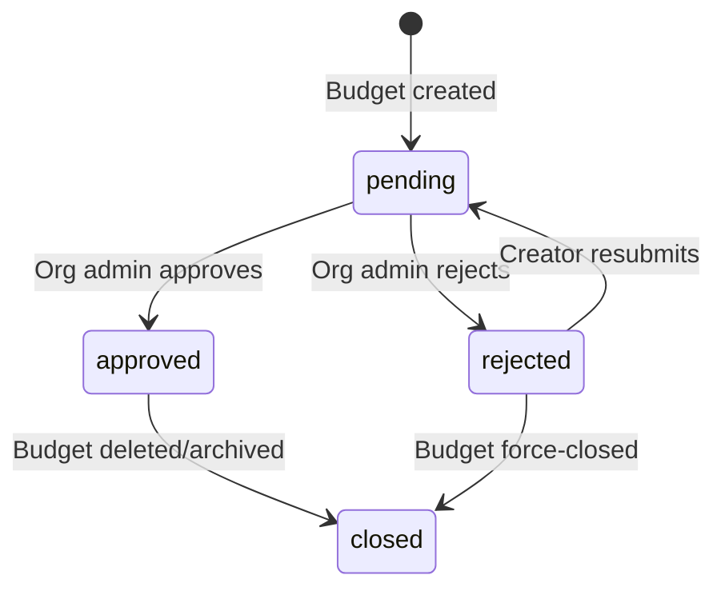

# Design

This document covers the API, data models, business logic, and workflows of the Quota Management system in technical depth.

---

## REST API

All management endpoints are served at `HTTP :8080`. The base path is `/api/v1`.

### Budgets

| Method   | Path                         | Description                                  |
| -------- | ---------------------------- | -------------------------------------------- |
| `GET`    | `/api/v1/budgets`            | List budgets (filtered by caller's org/team) |
| `POST`   | `/api/v1/budgets`            | Create a new budget                          |
| `GET`    | `/api/v1/budgets/{id}`       | Get a single budget                          |
| `PUT`    | `/api/v1/budgets/{id}`       | Update a budget                              |
| `DELETE` | `/api/v1/budgets/{id}`       | Soft-delete (disable) a budget               |
| `POST`   | `/api/v1/budgets/{id}/reset` | Manually reset current period usage          |
| `GET`    | `/api/v1/budgets/{id}/usage` | Get usage history for a budget               |
| `POST`   | `/api/v1/validate-cel`       | Validate a CEL expression                    |

**Budget object (abbreviated)**

```json
{
  "id": "uuid",
  "entity_type": "team",
  "name": "platform-eng-gpt4",
  "match_expression": "jwt.claims.team_id == 'platform-eng' && llm.model == 'gpt-4o'",
  "budget_amount_usd": 100.0,
  "current_usage_usd": 42.5,
  "pending_usage_usd": 1.2,
  "period": "monthly",
  "custom_period_seconds": null,
  "current_period_start": "2026-04-01T00:00:00Z",
  "warning_threshold_pct": 80,
  "parent_id": "uuid-of-org-budget",
  "isolated": false,
  "allow_fallback": true,
  "enabled": true,
  "approval_status": "approved",
  "owner_org_id": "acme",
  "owner_team_id": "platform-eng",
  "version": 5,
  "created_at": "2026-04-01T09:00:00Z"
}
```

### Model Costs

| Method   | Path                             | Description                  |
| -------- | -------------------------------- | ---------------------------- |
| `GET`    | `/api/v1/model-costs`            | List all model costs         |
| `POST`   | `/api/v1/model-costs`            | Add a new model              |
| `GET`    | `/api/v1/model-costs/{model_id}` | Get a single model's costs   |
| `PUT`    | `/api/v1/model-costs/{model_id}` | Update model pricing         |
| `DELETE` | `/api/v1/model-costs/{model_id}` | Remove a model               |
| `GET`    | `/api/v1/model-costs/providers`  | List distinct provider names |

**ModelCost object**

```json
{
  "id": "uuid",
  "model_id": "gpt-4o",
  "provider": "openai",
  "input_cost_per_million": 2.5,
  "output_cost_per_million": 10.0,
  "cache_read_cost_million": 1.25,
  "cache_write_cost_million": null,
  "model_pattern": "gpt-4o*",
  "effective_date": "2026-01-01T00:00:00Z"
}
```

### Rate Limit Allocations

| Method   | Path                       | Description             |
| -------- | -------------------------- | ----------------------- |
| `GET`    | `/api/v1/rate-limits`      | List all allocations    |
| `POST`   | `/api/v1/rate-limits`      | Create a new allocation |
| `GET`    | `/api/v1/rate-limits/{id}` | Get a single allocation |
| `PUT`    | `/api/v1/rate-limits/{id}` | Update an allocation    |
| `DELETE` | `/api/v1/rate-limits/{id}` | Remove an allocation    |

**RateLimitAllocation object**

```json
{
  "id": "uuid",
  "org_id": "acme",
  "team_id": "platform-eng",
  "model_pattern": "gpt-4*",
  "token_limit": 100000,
  "token_unit": "MINUTE",
  "request_limit": 60,
  "request_unit": "MINUTE",
  "burst_percentage": 20,
  "enforcement": "enforced",
  "enabled": true,
  "approval_status": "approved"
}
```

### Approvals

| Method | Path                                     | Description                |
| ------ | ---------------------------------------- | -------------------------- |
| `GET`  | `/api/v1/approvals`                      | List pending approvals     |
| `GET`  | `/api/v1/approvals/count`                | Count of pending approvals |
| `GET`  | `/api/v1/approvals/history`              | Full approval history      |
| `POST` | `/api/v1/approvals/{budget_id}/approve`  | Approve a budget           |
| `POST` | `/api/v1/approvals/{budget_id}/reject`   | Reject with reason         |
| `POST` | `/api/v1/approvals/{budget_id}/resubmit` | Resubmit rejected budget   |

### Audit Log

| Method | Path            | Description                                         |
| ------ | --------------- | --------------------------------------------------- |
| `GET`  | `/api/v1/audit` | Query audit log (supports filtering and pagination) |

Query parameters: `entity_type`, `entity_id`, `action`, `actor_user_id`, `org_id`, `from`, `to`, `limit`, `offset`.

---

## Database Schema

### `model_costs`

Stores per-model token pricing. Pre-seeded with 35+ models at startup.

```sql
CREATE TABLE model_costs (
  id                       UUID PRIMARY KEY DEFAULT gen_random_uuid(),
  model_id                 VARCHAR(255) UNIQUE NOT NULL,
  provider                 VARCHAR(100) NOT NULL,
  input_cost_per_million   DECIMAL(20,8) NOT NULL,
  output_cost_per_million  DECIMAL(20,8) NOT NULL,
  cache_read_cost_million  DECIMAL(20,8),
  cache_write_cost_million DECIMAL(20,8),
  model_pattern            VARCHAR(255),
  effective_date           TIMESTAMPTZ NOT NULL,
  created_by_user_id       VARCHAR(255),
  created_by_email         VARCHAR(255),
  created_at               TIMESTAMPTZ DEFAULT NOW(),
  updated_at               TIMESTAMPTZ DEFAULT NOW()
);
```

Pre-seeded providers: OpenAI, Anthropic, Google, Mistral, AWS Nova.

Pattern matching: `model_pattern` allows approximate lookups. If `gpt-4o-2025-04` is not found, the system tries `gpt-4o*` pattern before giving up.

### `budget_definitions`

```sql
CREATE TABLE budget_definitions (
  id                     UUID PRIMARY KEY DEFAULT gen_random_uuid(),
  entity_type            VARCHAR(50) NOT NULL CHECK (entity_type IN ('provider','org','team')),
  name                   VARCHAR(255) NOT NULL,
  match_expression       TEXT NOT NULL,
  budget_amount_usd      DECIMAL(20,8) NOT NULL,
  period                 VARCHAR(20) NOT NULL CHECK (period IN ('hourly','daily','weekly','monthly','custom')),
  custom_period_seconds  INTEGER,
  warning_threshold_pct  INTEGER DEFAULT 80,
  parent_id              UUID REFERENCES budget_definitions(id),
  isolated               BOOLEAN DEFAULT FALSE,
  allow_fallback         BOOLEAN DEFAULT FALSE,
  enabled                BOOLEAN DEFAULT TRUE,
  disabled_by_user_id    VARCHAR(255),
  disabled_by_email      VARCHAR(255),
  disabled_by_is_org     BOOLEAN,
  disabled_at            TIMESTAMPTZ,
  current_period_start   TIMESTAMPTZ NOT NULL DEFAULT NOW(),
  current_usage_usd      DECIMAL(20,8) DEFAULT 0,
  pending_usage_usd      DECIMAL(20,8) DEFAULT 0,
  version                BIGINT DEFAULT 1,
  description            TEXT,
  owner_org_id           VARCHAR(255),
  owner_team_id          VARCHAR(255),
  approval_status        VARCHAR(20) DEFAULT 'pending'
                           CHECK (approval_status IN ('pending','approved','rejected','closed')),
  created_by_user_id     VARCHAR(255),
  created_by_email       VARCHAR(255),
  rejection_count        INTEGER DEFAULT 0,
  created_at             TIMESTAMPTZ DEFAULT NOW(),
  updated_at             TIMESTAMPTZ DEFAULT NOW(),
  UNIQUE(entity_type, name)
);
```

**version field**: Optimistic locking. Updates must include the current version; the server rejects stale writes with 409 Conflict.

**approval_status lifecycle**:

```
pending → approved (by org admin)
        → rejected (by org admin, with reason)
rejected → pending (creator resubmits)
approved → closed  (budget deleted/archived)
```

Only `approved` budgets are loaded into the enforcement cache. Creating a budget always starts at `pending`.

### `usage_records`

Immutable record of every actual charge. Not updated, only appended.

```sql
CREATE TABLE usage_records (
  id             UUID PRIMARY KEY DEFAULT gen_random_uuid(),
  budget_id      UUID NOT NULL REFERENCES budget_definitions(id),
  request_id     VARCHAR(255) NOT NULL,
  model_id       VARCHAR(255),
  input_tokens   BIGINT,
  output_tokens  BIGINT,
  cost_usd       DECIMAL(20,8) NOT NULL,
  parent_charged BOOLEAN DEFAULT FALSE,
  created_at     TIMESTAMPTZ DEFAULT NOW()
);
```

`parent_charged`: set to `true` when the parent budget was also charged for this request (hierarchical non-isolated budgets).

### `request_reservations`

Ephemeral rows created pre-request, deleted post-response. Auto-expire after `RESERVATION_TTL` (default 5 min) to handle cases where the response never arrives.

```sql
CREATE TABLE request_reservations (
  id                  UUID PRIMARY KEY DEFAULT gen_random_uuid(),
  budget_id           UUID NOT NULL REFERENCES budget_definitions(id),
  request_id          VARCHAR(255) NOT NULL,
  estimated_cost_usd  DECIMAL(20,8) NOT NULL,
  expires_at          TIMESTAMPTZ NOT NULL,
  created_at          TIMESTAMPTZ DEFAULT NOW(),
  UNIQUE(budget_id, request_id)
);
```

`pending_usage_usd` on `budget_definitions` is the sum of all active reservations for that budget. This prevents double-spending: two concurrent requests cannot both consume the same remaining budget.

### `budget_approvals`

Append-only history of approval actions. `attempt_number` increments on each resubmission cycle.

```sql
CREATE TABLE budget_approvals (
  id             UUID PRIMARY KEY DEFAULT gen_random_uuid(),
  budget_id      UUID NOT NULL REFERENCES budget_definitions(id),
  attempt_number INTEGER NOT NULL DEFAULT 1,
  action         VARCHAR(50) NOT NULL,  -- submitted, approved, rejected
  actor_user_id  VARCHAR(255),
  actor_email    VARCHAR(255),
  reason         TEXT,
  created_at     TIMESTAMPTZ DEFAULT NOW(),
  updated_at     TIMESTAMPTZ DEFAULT NOW()
);
```

### `rate_limit_allocations`

```sql
CREATE TABLE rate_limit_allocations (
  id               UUID PRIMARY KEY DEFAULT gen_random_uuid(),
  org_id           VARCHAR(255) NOT NULL,
  team_id          VARCHAR(255) NOT NULL,
  model_pattern    VARCHAR(255) NOT NULL,
  token_limit      BIGINT,
  token_unit       VARCHAR(20) CHECK (token_unit IN ('SECOND','MINUTE','HOUR','DAY')),
  request_limit    BIGINT,
  request_unit     VARCHAR(20) CHECK (request_unit IN ('SECOND','MINUTE','HOUR','DAY')),
  burst_percentage INTEGER DEFAULT 0,
  enforcement      VARCHAR(20) DEFAULT 'enforced'
                     CHECK (enforcement IN ('enforced','monitoring')),
  enabled          BOOLEAN DEFAULT TRUE,
  approval_status  VARCHAR(20) DEFAULT 'pending'
                     CHECK (approval_status IN ('pending','approved','rejected','closed')),
  -- audit fields ...
  UNIQUE(org_id, team_id, model_pattern)
);
```

### `audit_log`

```sql
CREATE TABLE audit_log (
  id           UUID PRIMARY KEY DEFAULT gen_random_uuid(),
  entity_type  VARCHAR(100) NOT NULL,
  entity_id    VARCHAR(255) NOT NULL,
  action       VARCHAR(100) NOT NULL,
  actor_user_id VARCHAR(255),
  actor_email  VARCHAR(255),
  org_id       VARCHAR(255),
  team_id      VARCHAR(255),
  metadata     JSONB,
  created_at   TIMESTAMPTZ DEFAULT NOW()
);
```

`metadata` is a free-form JSONB blob for additional context (e.g., old vs. new values on update).

---

## Business Logic

### Cost Calculation

```
actual_cost = (input_tokens / 1,000,000) × input_cost_per_million
            + (output_tokens / 1,000,000) × output_cost_per_million
```

Cache read costs are charged separately when present in the response.

**Estimated cost** (pre-request, before actual tokens are known):

```
estimated_cost = ((DEFAULT_ESTIMATED_INPUT_TOKENS / 1,000,000) × input_cost
               + (DEFAULT_ESTIMATED_OUTPUT_TOKENS / 1,000,000) × output_cost)
               × DEFAULT_ESTIMATION_MULTIPLIER
```

Defaults: 1000 input tokens, 1000 output tokens, 1.5× multiplier. This conservative estimate reduces the risk of under-reserving on expensive requests.

**Model fallback**: if `gpt-4o-2026-04` is not in model_costs, the service strips the version suffix and tries `gpt-4o`. If still not found, it checks `model_pattern` columns for a wildcard match. If no match, cost is treated as 0 (fail-open).

### Budget Matching

Budget matching iterates all `approved` and `enabled` budgets, evaluating each one's `match_expression` against the request context. Multiple budgets can match a single request (e.g., a team budget and its org-level parent).

Evaluation order: children before parents (sorted by `parent_id IS NULL ASC`, then by entity_type specificity). This ensures the child is exhausted before falling back.

**CEL context variables**:

| Variable             | Type   | Example                     |
| -------------------- | ------ | --------------------------- |
| `llm.model`          | string | `"gpt-4o"`                  |
| `jwt.claims.org_id`  | string | `"acme-corp"`               |
| `jwt.claims.team_id` | string | `"platform-eng"`            |
| `jwt.claims.sub`     | string | `"user-123"`                |
| `request.headers`    | map    | `{"x-environment": "prod"}` |
| `source.address`     | string | `"10.0.0.5"`                |

### Budget Period Reset

Automatic reset runs every `PERIOD_RESET_INTERVAL` (default 1 min). The query:

```sql
SELECT * FROM budget_definitions
WHERE enabled = true
  AND current_period_start + (period_seconds * INTERVAL '1 second') < NOW()
```

On reset:

1. Set `current_usage_usd = 0`
2. Set `pending_usage_usd = 0`
3. Set `current_period_start = NOW()`
4. Increment `version`
5. Delete any stale `request_reservations` for this budget

Period durations:

| Period  | Seconds                 |
| ------- | ----------------------- |
| hourly  | 3600                    |
| daily   | 86400                   |
| weekly  | 604800                  |
| monthly | 2592000 (30 days)       |
| custom  | `custom_period_seconds` |

### Optimistic Locking

All budget update operations pass the current `version` value. The SQL update:

```sql
UPDATE budget_definitions
SET current_usage_usd = current_usage_usd + $cost,
    version = version + 1
WHERE id = $id AND version = $expected_version
```

If 0 rows are affected, the update is retried up to 3 times with exponential backoff. After 3 failures, an error is returned (charge is lost but request succeeds—fail-open).

### Concurrent Reservation Safety

`request_reservations` has a `UNIQUE(budget_id, request_id)` constraint. `pending_usage_usd` is always maintained as a sum:

```sql
UPDATE budget_definitions
SET pending_usage_usd = pending_usage_usd + $estimated_cost
WHERE id = $budget_id
```

The budget check evaluates:

```
current_usage_usd + pending_usage_usd + estimated_cost ≤ budget_amount_usd
```

This ensures concurrent requests cannot both succeed if only one of them fits within the remaining budget.

---

## Approval Workflow



Only org admins (identified by `is_org=true` in JWT claims) can approve or reject. Creators can resubmit their own rejected budgets. Each resubmission increments `attempt_number` in `budget_approvals`.

The approval count is surfaced in the UI via `GET /api/v1/approvals/count` so admins always know how many items need attention.

---

## Authentication and RBAC

### Identity Extraction

Identity is extracted from the JWT Bearer token in the `Authorization` header:

```go
type Identity struct {
  Subject  string  // JWT sub
  Email    string  // JWT email
  OrgID    string  // JWT org_id claim
  TeamID   string  // JWT team_id claim
  IsOrg    bool    // JWT is_org claim
}
```

### Permission Matrix

| Action                | Org Admin | Team Member  | Unauthenticated |
| --------------------- | --------- | ------------ | --------------- |
| List org's budgets    | ✓ all     | ✓ team only  | ✓ read-only     |
| Create budget         | ✓         | ✓ own team   | ✗               |
| Approve/reject budget | ✓         | ✗            | ✗               |
| Resubmit budget       | ✓         | ✓ own budget | ✗               |
| Disable budget        | ✓         | ✗            | ✗               |
| Manage model costs    | ✓         | ✗            | ✓ read-only     |
| Manage rate limits    | ✓         | ✓ own team   | ✗               |
| View audit log        | ✓         | ✓ own team   | ✗               |

### Middleware

`OptionalAuthMiddleware` is non-blocking in the current implementation: missing or invalid JWTs are accepted and treated as unauthenticated. This is intentional for demo environments where clients may not carry tokens. Production deployments should swap this for a strict auth middleware.

---

## CEL Expression Engine

The CEL evaluator compiles and caches expression programs:

```go
// Compilation (once per unique expression)
ast, issues := env.Compile(expression)
prog, err := env.Program(ast)
// Cached in sync.Map keyed by expression string

// Evaluation (per request)
out, _, err := prog.Eval(map[string]interface{}{
  "llm": map[string]interface{}{"model": modelID},
  "jwt": map[string]interface{}{"claims": jwtClaims},
  "request": map[string]interface{}{"headers": headers},
  "source": map[string]interface{}{"address": sourceIP},
})
```

CEL programs are stateless after compilation—the same compiled program can be evaluated concurrently by multiple goroutines.

**Validation endpoint** (`POST /api/v1/validate-cel`) compiles the expression and returns any syntax errors before the user saves the budget. This prevents invalid expressions from entering the database.

---

## ext-proc Protocol Detail

Both ext-proc servers implement the Envoy `ExternalProcessor` gRPC service:

```protobuf
service ExternalProcessor {
  rpc Process(stream ProcessingRequest) returns (stream ProcessingResponse);
}
```

Each request/response exchange is a bidirectional stream. The filter calls the ext-proc server at configurable phases:

| Phase            | Trigger                   | extproc-budget action                   | extproc-ratelimit action   |
| ---------------- | ------------------------- | --------------------------------------- | -------------------------- |
| `RequestHeaders` | Before forwarding request | Check budget, create reservation        | Inject rate limit metadata |
| `ResponseBody`   | After receiving response  | Charge actual cost, release reservation | No-op                      |

**Blocking vs. non-blocking**: `extproc-budget` can return an `ImmediateResponse` with status 429 to block a request. `extproc-ratelimit` never blocks—it only sets metadata.

**Request body parsing**: LLM model extraction in `extproc-ratelimit` parses the JSON request body to find the `model` field. This adds a small latency overhead (~microseconds for typical payloads).

---

## UI Architecture

The React SPA is served as static assets from the Go management API at `/`.

### Routing

```
/                    → Redirect to /budgets
/budgets             → Budget list
/budgets/:id         → Budget detail + usage history
/model-costs         → Model cost catalog
/rate-limits         → Rate limit allocations (if enabled)
/approvals           → Approval queue
/audit               → Audit log viewer
```

### Data Fetching

All API calls use [SWR](https://swr.vercel.app/) for:

- Automatic revalidation on focus
- Stale-while-revalidate cache
- Deduplication of concurrent requests
- Error retry with backoff

### Feature Flags

The UI reads `src/config.ts` for runtime flags:

```typescript
export const config = {
  enableRateLimits: true, // Show /rate-limits section
  enableApprovals: true, // Show /approvals section
  enableAudit: true, // Show /audit section
};
```

These can be set at build time via Vite environment variables.

---

## Pre-Seeded Model Costs

The database migration seeds the following models at first startup:

| Provider  | Models                                                                                                                   |
| --------- | ------------------------------------------------------------------------------------------------------------------------ |
| OpenAI    | gpt-4, gpt-4-turbo, gpt-4o, gpt-4o-mini, gpt-3.5-turbo, o1, o1-mini, o3, o3-mini                                         |
| Anthropic | claude-opus-4-5, claude-sonnet-4-5, claude-haiku-4-5, claude-3-5-sonnet, claude-3-5-haiku, claude-3-opus, claude-3-haiku |
| Google    | gemini-2.5-pro, gemini-2.5-flash, gemini-2.0-pro, gemini-2.0-flash, gemini-1.5-pro, gemini-1.5-flash                     |
| Mistral   | mistral-large, mistral-medium, mistral-small, mistral-7b                                                                 |
| AWS       | nova-micro, nova-lite, nova-pro                                                                                          |

Pricing is stored per 1,000,000 tokens. Costs can be updated via the UI or API without requiring a service restart (cache TTL 60s).
